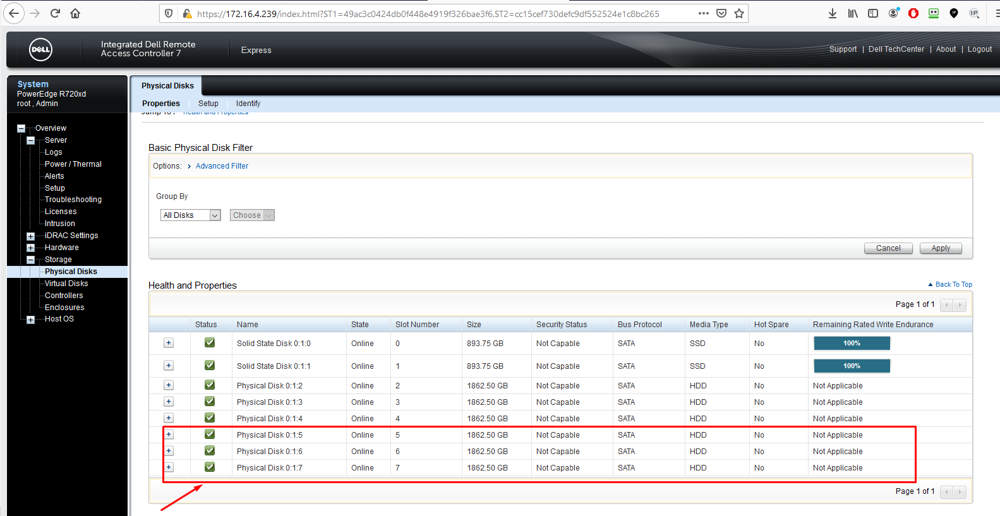

# Ghi chép các bước thao tác với một số case card raid H730 mini

Card raid H710mini thường dùng trong dòng Dell R620, Dell R720 hỗ trợ các mode raid 0, 1, 5, 6, 10


Cài megacli để hỗ trợ lệnh check raid

```
yum install -y pciutils 

yum install sg3_utils wget git -y
git clone https://github.com/nhanhoadocs/ghichep-megacli.git
rpm -ivh ghichep-megacli/MegaCli8.07.14/Linux/MegaCli-8.07.14-1.noarch.rpm
echo "alias megacli='/opt/MegaRAID/MegaCli/MegaCli64'" >> /root/.bashrc
source /root/.bashrc
```


## 1. Trường hợp hỏng 1 ổ lắp ổ mới vào raid1

- Ở trạng thái RAID1 chạy ổ định


- Khi 1 ổ bị hỏng sẽ báo `DEGRADED`


- Chuẩn bị 1 ổ mới tinh, clear raid, cùng chủng loại, formart.


Card hỗ trợ auto rebuild nhưng phải check chắc chắn bằng lệnh

```
megacli -AdpAllinfo  -aALL  | grep -i rebuild
```


Cắm thay thế ổ hỏng.

Chạy lệnh để xem ổ đang rebuild

```
megacli -PDList -aALL | grep "Firmware state"
```


Hoặc xem all

```
megacli -PDList -aALL
```

Xem % đang rebuild

```
megacli -PDRbld -ShowProg -PhysDrv [32:1] -aALL
```

Trong đó 32:1 là các tham số sau: check băng lệnh

```
megacli -PDList -aall
```

```
Enclosure Device ID: 32
Slot Number: 1
```


Tùy vào lượng dữ liệu nhiều hay ít nên thời gian rebuild lâu hay nhanh trung bình 2GB mất 10 phút. Sau khi rebuild xong

**Lưu ý**: Trường hợp đang rebuild đồng bộ dữ liệu mà server mất điện, có điện dữ liệu vẫn tiếp tục đồng bộ sang ổ mới cắm.


## 2. Trường hợp rút ổ khỏi bay

Khi raid đang chạy ổn định nếu rút 1 ổ khỏi raid ra thì tùy từng mode raid sẽ có thông báo khác nhau. Ví dụ như raid 1 sẽ có thông báo degrate.

Sau khi cắm lại chính ổ đó quá trình rebuild sẽ diễn ra.


## 3. Trường hợp thay thế card raid

Chuẩn bị 1 card raid cùng loại

- Nếu card raid đó chưa tạo raid thì cắm vào cái nhận luôn không phải thao tác gì thêm.

- Thực hiện vào import lại raid:


## 4. Trường hợp 2 ổ OS hỏng có ổ OS cài sẵn mang lên thay OS

- Chuẩn bị 2 ổ mới cùng loại raid 1 cài OS bình thường.

- Tắt server tháo 2 ổ đó mang đi thay thế lưu ý đúng vị trí slot.

- Tắt server cần thay ổ lắp 2 ổ mới và bật lên.

- Vào mode RAID thực hiện import


## 5. Mở rộng raid

### 5.1 Raid 5 add thêm ổ mới (OS windows)

- Có 1 server Dell chạy card H710mini raid 5 3 ổ, add thêm 1 ổ nữa để tăng dung lượng (OS cài windows server 2012).


- Chuẩn bị 1 ổ mới cùng loại, cùng dung lượng, cắm vào server, ổ mới sẽ ở trạng thái ready


- Reboot server ấn `F2` vào `Setting`


Đợi cho đến khi hoàn thành khoảng 2 tiếng.

Có thể xem tiến trình reconfigure ở giao diện iDRAC


Sau khi cấu trúc lại ổ đĩa sẽ tới bước cài đặt `Background initialization` (khoảng 30 phút).

Dung lượng raid sẽ tăng lên


Back lại finish và boot vào OS.

Trong OS windows phải online volume


+ Tạo ra 1 phần vùng riêng


+ Gộp luôn vào ổ C


### 5.2 Raid 5 add thêm ổ mới (OS Linux)

- Tất cả các phân vùng chia Standard


- Thực hiện add disk như phần 5.1

Sau khi ổ mới add vào dung lượng `sda` sẽ tăng lên nhưng phân vùng `/` chưa được 


- Thực hiện resize phân vùng mới.


```
yum -y install cloud-utils-growpart
growpart /dev/sda 3
resize2fs /dev/sda3
```
### 5.3 Raild 0 add thêm ổ cứng mới ( CentOS 7 )
- Hiển có 1 server Dell 620 sử dụng card 710 mini Raid 0 với 1 ổ cần tăng dung lượng.


- Chuẩn bị 1 ổ mới cùng loại, cùng dung lượng, cắm vào server, ổ mới sẽ ở trạng thái ready


- Tiến hành reboot server bấm `F2` để vào `Setting`


- Sau khi hoàn thành các bước trên tiến hành khởi động lại server và test kiểm tra gửi nhận mail, nếu gửi nhận mail thì `OK`


- Tiến hành theo dõi quán trình mở rộng qua `IDRAC`


- Sau khi quá trình thành công tiến hoành `reboot ` và  truy cập `SSH` tiến hành resize phân dùng ổ cứng.

```
resize2fs /dev/sdb

```

Kiểm tra lại phân vùng

```

df -h
```


Kiểm tra gửi nhận mail 

## 6. Tạo thêm 1 phần vùng raid mới trên iDRAC

Card h710mini có hỗ trợ hiển thị trên iDRAC để quản lý các ổ. Đối với 1 server ổn định muốn tạo thêm 1 phần vùng raid mới có thể thực hiện trên giao diện của iDRAC.

- Chuẩn bị các ổ đã được formart định dạng lại ổ trắng tinh

Trước khi cắm thêm ổ


Cắm thêm các ổ cần tạo raid


- Tạo raid 5 từ giao diện iDRAC

Click `Virtual Disks` -> `Create` -> Lựa chọn các mode RAID


Click `Select Physical Disks`


Lưu ý: Hoàn thành sau khi reboot server thì phân vùng raid mới mới được tạo.




## 7. Tạo raid với lệnh megacli

Để tạo được raid bằng lệnh phải xác định được các tham số: `Adapter ID`,  `Enclosure ID`, `Slot Number` 

```
megacli -PDList -aALL | egrep 'Adapter|Enclosure|Slot'
```


```
megacli -CfgLdAdd -r5 [32:2,32:3,32:4] -a0
```


Sau khi tạo xong thì raid5 xuất hiện nhưng phải đợi lâu để quá trình tái cấu trúc lại ổ đĩa.


```
megacli -ShowSummary -aALL
```


### Tham khảo

- Lệnh magraraid CLI

https://wikitech.wikimedia.org/wiki/MegaCli


- Tạo raid với megacli

http://fibrevillage.com/storage/374-megacli-raid-0-1-5-6-and-raid50-raid60-creation-examples


