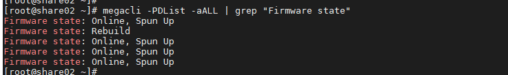
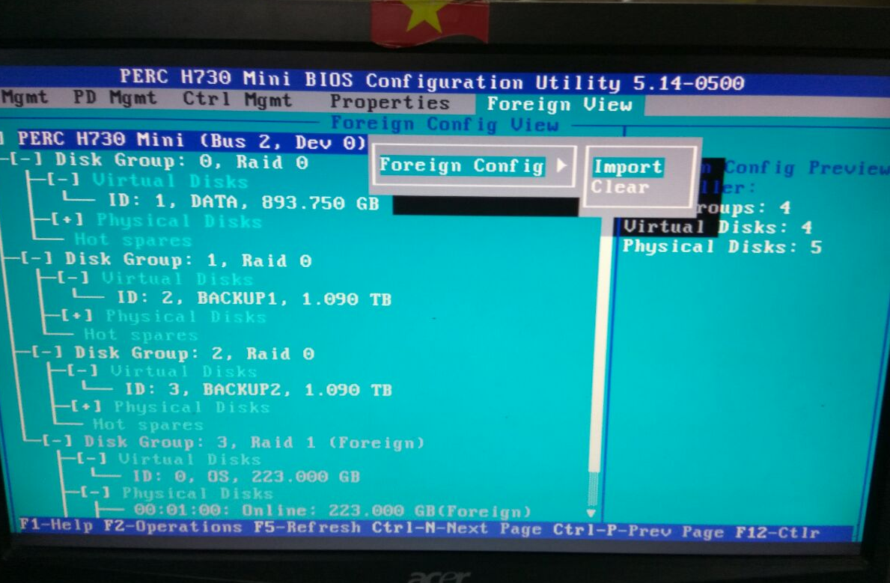
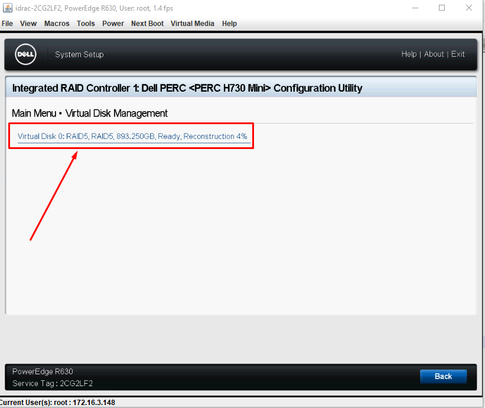
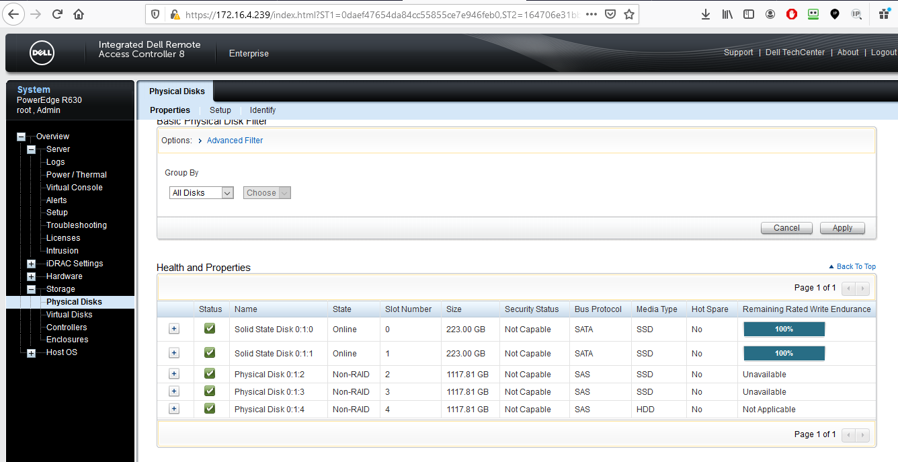
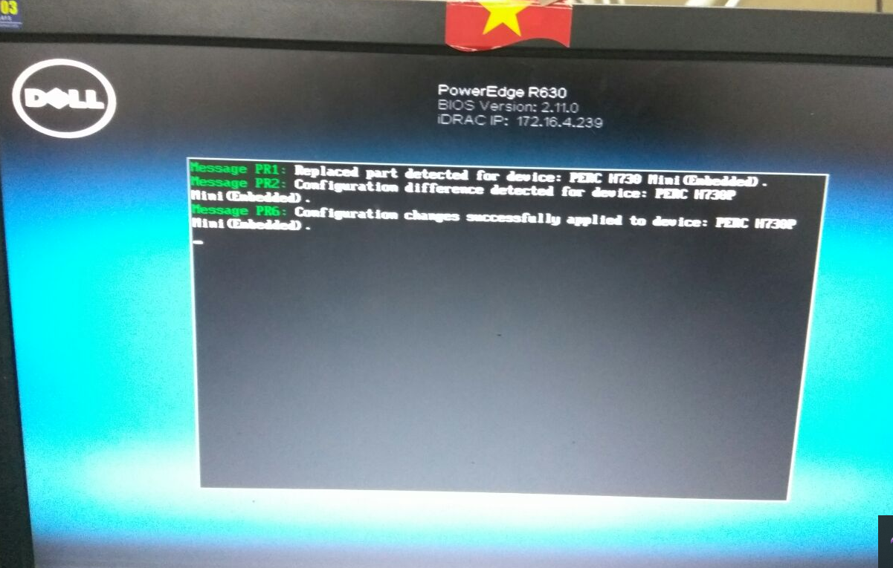
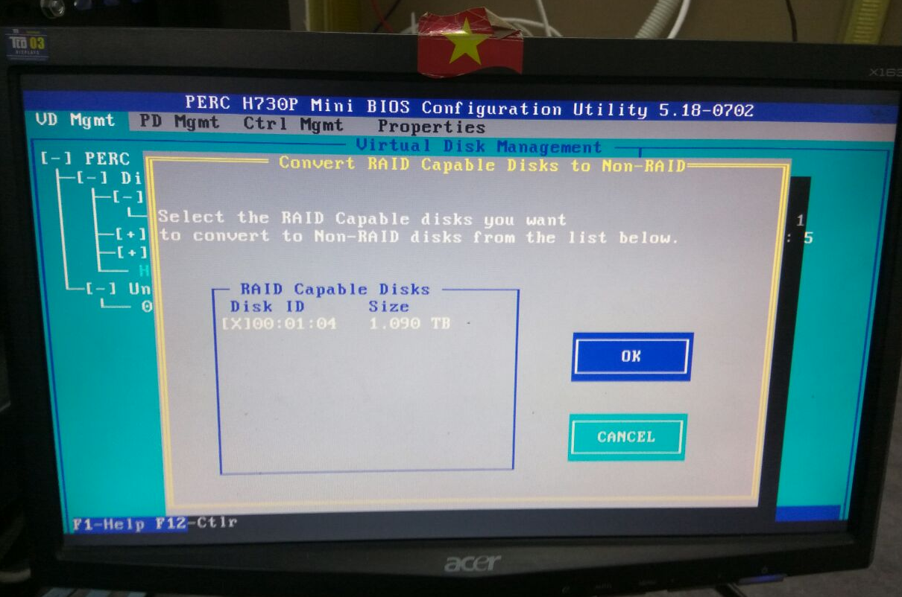
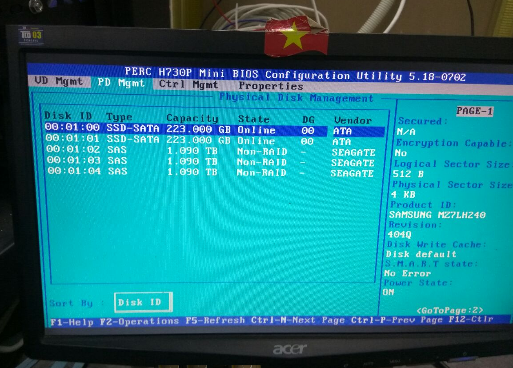

# Ghi chép các bước thao tác với một số case card raid H730 mini

Card raid H730mini thường dùng trong dòng Dell R630, Dell R730 hỗ trợ các mode raid 0, 1, 5, 6, 10


Cài megacli để hỗ trợ lệnh check raid

```
yum install -y pciutils 

yum install sg3_utils wget git -y
git clone https://github.com/nhanhoadocs/ghichep-megacli.git
rpm -ivh ghichep-megacli/MegaCli8.07.14/Linux/MegaCli-8.07.14-1.noarch.rpm
echo "alias megacli='/opt/MegaRAID/MegaCli/MegaCli64'" >> /root/.bashrc
source /root/.bashrc
```


## 1. Trường hợp hỏng 1 ổ lắp ổ mới vào raid1

- Ở trạng thái RAID1 chạy ổ định


- Khi 1 ổ bị hỏng sẽ báo `DEGRADED`


- Chuẩn bị 1 ổ mới tinh, clear raid, cùng chủng loại, formart.


Card hỗ trợ auto rebuild nhưng phải check chắc chắn bằng lệnh

```
megacli -AdpAllinfo  -aALL  | grep -i rebuild
```


Cắm thay thế ổ hỏng.


Chạy lệnh để xem ổ đang rebuild

```
megacli -PDList -aALL | grep "Firmware state"
```



Hoặc xem all

```
megacli -PDList -aALL
```

Xem % đang rebuild

```
megacli -PDRbld -ShowProg -PhysDrv [32:1] -aALL
```

Trong đó 32:1 là các tham số sau: check băng lệnh

```
megacli -PDList -aall
```

```
Enclosure Device ID: 32
Slot Number: 1
```


Tùy vào lượng dữ liệu nhiều hay ít nên thời gian rebuild lâu hay nhanh trung bình 2GB mất 10 phút. Sau khi rebuild xong

**Lưu ý**: Trường hợp đang rebuild đồng bộ dữ liệu mà server mất điện, có điện dữ liệu vẫn tiếp tục đồng bộ sang ổ mới cắm.


## 2. Trường hợp rút ổ khỏi bay

Khi raid đang chạy ổn định nếu rút 1 ổ khỏi raid ra thì tùy từng mode raid sẽ có thông báo khác nhau. Ví dụ như raid 1 sẽ có thông báo degrate.

Sau khi cắm lại chính ổ đó quá trình rebuil sẽ diễn ra.


## 3. Trường hợp thay thế card raid

Chuẩn bị 1 card raid cùng loại

- Nếu card raid đó chưa tạo raid thì cắm vào cái nhận luôn không phải thao tác gì thêm.

- Nếu card đó đã dùng để tạo raid rồi thì sau khi thay card sẽ phải import lại:


+ Có thể phải import trong card raid

+ Hoặc có TH cắm card mới xong rever tự detect tới bước như ảnh dưới reboot lại là ăn.


## 4. Trường hợp 2 ổ OS hỏng có ổ OS cài sẵn mang lên thay OS

- Chuẩn bị 2 ổ mới cùng loại raid 1 cài OS bình thường.

- Tắt server tháo 2 ổ đó mang đi thay thế lưu ý đúng vị trí slot.

- Tắt server cần thay ổ lắp 2 ổ mới và bật lên.

- Vào mode RAID thực hiện import





## 5. Mở rộng raid

### 5.1 Raid 5 add thêm ổ mới

- Có 1 server Dell chạy card H730mini raid 5 3 ổ, add thêm 1 ổ nữa để tăng dung lượng (OS cài windows server 2012).


- Chuẩn bị 1 ổ mới cùng loại, cùng dung lượng, cắm vào server


- Reboot server ấn `F2` vào `Setting`


Chờ có tới khi ổ mới add vào tái cấu trúc lại raid (khoảng 2 tiếng).



ổ được add mới vào raid5 sẽ chuyển từ ready sang online


Sau khi cấu trúc lại ổ đĩa sẽ tới bước cài đặt `Background initialization` (khoảng 30 phút).


Dung lượng disk đã tăng khi thêm 1 disk vào raid 5


Trong OS windows phải online volume


Sẽ tạo ra một phân vùng mới nhưng cùng trong raid 5


Có thể gộp lại thành 1 ổ C


Chọn gộp với phần vùng disk vừa thêm vào.


Dữ liệu cũ trước khi add ổ vần còn


## 6. Thay card raid đối với CEPH

- Dựng một node CEPH AIO

+ 2 ổ OS RAID1 
+ 3 ổ OSD none-raid add vào bằng lệnh megacli

```
megacli -PDMakeGood -PhysDrv[32:2, 32:3, 32:4] -Force -a0
megacli -PDMakeJBOD -PhysDrv[32:2, 32:3, 32:4] -a0
```




- Chuẩn bị một card raid tương tự và tiến hành thay thế.

- Reboot lại server

+ Có TH raid 1 OS tự import sau khi reboot 2 lần.

+ TH raid 1 OS không nhận phải import như trong ảnh.




- Lúc này 3 OSD kiểu none-raid sẽ không nhận, ổ ở trạng thái `ready`


- Thực hiện convert to none raid trên giao diện Ctrl+R






Có thể thực hiện trên megacli


Thực hiện lần lượt với các ổ OSD còn lại. Kiểm tra dữ liệu.


Dữ liệu trên client tích hợp với CEPH vẫn còn.


### Tham khảo

- Lệnh magraraid CLI

https://wikitech.wikimedia.org/wiki/MegaCli

- RAID

https://www.dell.com/support/article/en-vn/sln305744/dell-poweredge-how-to-change-the-raid-level-of-a-virtual-disk?lang=en

https://www.dell.com/support/article/en-vn/sln292050/dell-servers-what-are-the-raid-levels-and-their-specifications?lang=en

https://www.youtube.com/watch?v=MyjrAtBvpBU


